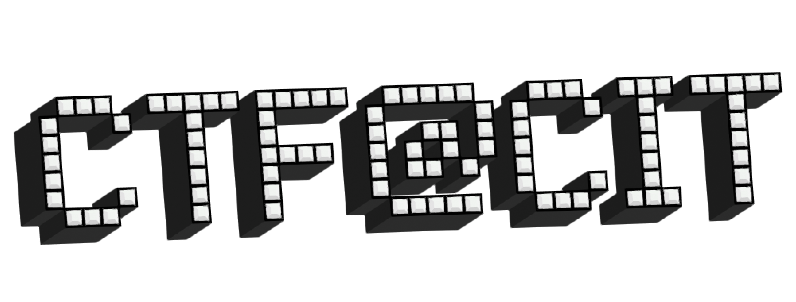

  

# CTF@CIT 2025

This is University of New Haven student-run CTF event. It will cover categories such as forensics, OSINT, reverse, crypto, misc, and much more!

URL: https://ctf.cyber-cit.club/challenges

# Table of contents

* [Web](Web)
  * [Breaking-Authentication](Web/Breaking-Authentication.md)
  * [Commit-Order-Version-Control-Unit](Web/Commit-Order-Version-Control-Unit.md)
  * [How-I-Parsed-your-JSON](Web/How-I-Parsed-your-JSON.md)
  * [Keeping-Up-with-the-Credentials](Web/Keeping-Up-with-the-Credentials.md)
  * [Mr-Chatbot](Web/Mr-Chatbot.md)
