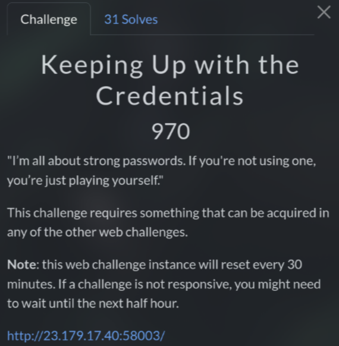

# Keeping Up with the Credentials (970 pts)



In previous web challenges like **Breaking Authentication** and **How I Parsed your JSON**, you may notice that there is a credential show up: `admin:9f3IC3uj9^zZ`

When using this credential to login, it redirects to `/debug.php`. If you see it similar, this is from **Commit & Order: Version Control Unit** challenge

So I tried to visit `/admin.php` and I was logged out

This is a part of `index.php` source code from **Commit & Order: Version Control Unit**:

```php
<?php

session_start();

if (!isset($_SESSION['username'])) {
    $_SESSION['username'] = 'loggedout';
}

if (isset($_POST['username']) && isset($_POST['password'])){

	$username = $_POST['username'];
	$password = $_POST['password'];

    if ($username == 'admin' && $password == '9f3IC3uj9^zZ'){
        $_SESSION['username'] = $username;
        header('Location: /admin.php', true);
        exit();
    }
    else {
        $_SESSION['username'] = $username;
	   $_SESSION['message'] = 'Invalid username or password.';
    }
}
?>
```

You see the code uses a POST request, while the challenge used a GET request. So I used Burp Suite to change the method to POST and then sent the request again

This time, it redirected me to `/admin.php` and I got the flag

`Flag: CIT{7bf610e96ade83db}`
