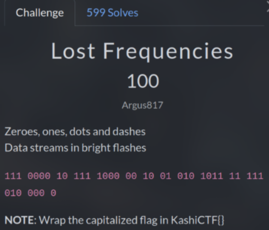
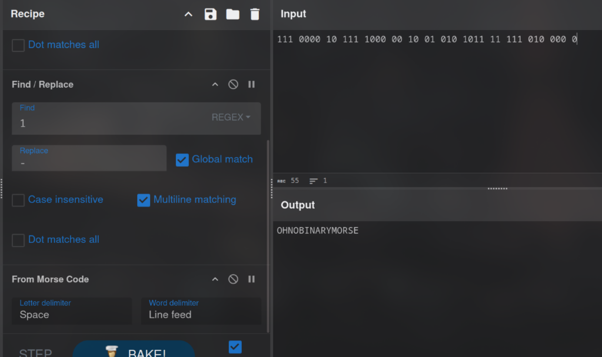

# Lost Frequencies (100 pts)

First, I tried binary decode but no luck, so I think this may a type of morse code

Then I used `CyberChef` to replace `0` and `1` to `.` and `-` and successfully get the first flag

`https://gchq.github.io/CyberChef/#recipe=Find_/_Replace(%7B'option':'Regex','string':'0'%7D,'.',true,false,true,false)Find_/_Replace(%7B'option':'Regex','string':'1'%7D,'-',true,false,true,false)From_Morse_Code('Space','Line%20feed')&input=MTExIDAwMDAgMTAgMTExIDEwMDAgMDAgMTAgMDEgMDEwIDEwMTEgMTEgMTExIDAxMCAwMDAgMA`

`Flag: KashiCTF{OHNOBINARYMORSE}`
