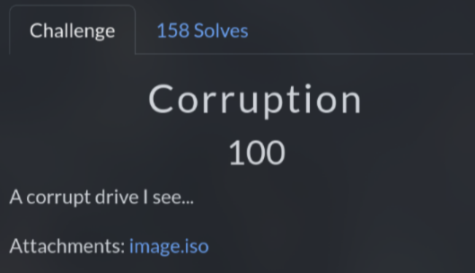

# Corruption (100 pts)

Like **Memories Bring Back You**, I just download the `image.iso` then run `strings image.iso | grep Kashi` and I got the flag Σ(O_O)

`Flag: KashiCTF{FSCK_mE_B1T_by_b1t_Byt3_by_byT3}`
