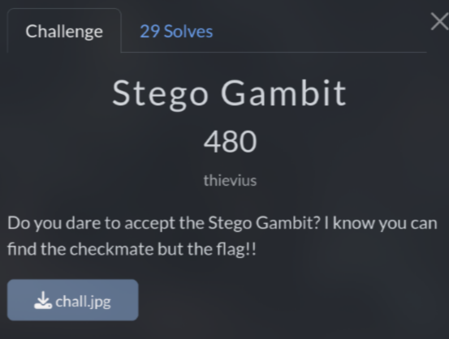
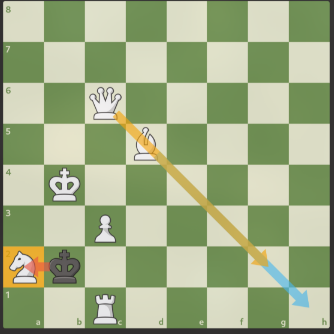

# Stego Gambit (480 pts)



As you can see, this is a chess board and **White** moves to checkmate


First, I use `exiftool` and I found a comment `Use the moves as a key to the flag, separated by _`

Combine with the challenge title and experience from previous ctf contests, I can guess the flag was hidden by using `steghide`

So now I need to find the checkmate move. As a 1k9 Elo chess player, I can solve it easily

Basically, you need to sacrifice the **Knight** by moving the **Bishop** to **h1**, the **Black King** will force to capture the **Knight** then **Queen** go **g2** checkmate!



```txt
1.Bh1 Kxa2 2.Qg2#
```

If you guys not good at chess, just visit `chess.com` or `lichess.org` and use their bot to solve it

Now, go to the guessing part. At first, I didn't clearly understand the comment, so I thought just replace all space with `_`. But actually, we just need to separate each turns

And this is the final key: `Bh1Kxa2_Qg2#`

Finally, I use `steghide` to extract the hidden flag

```sh
steghide extract -sf chall.jpg -xf flag.txt
```

`Flag: KashiCTF{573g0_g4m617_4cc3p73d}`
