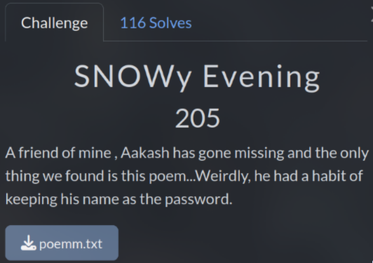
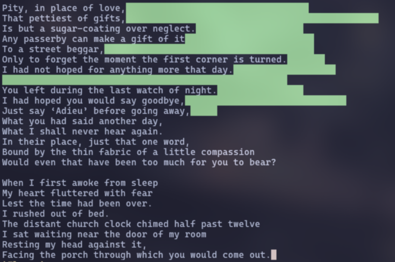

# SNOWy Evening (205 pts)



In this poem, there is nothing special, until you decide copy it



Look like this is a text-based steganography and based on the title, it use some `snow` tool??

After some search, I know it use `stegsnow` tool to hide data

But the `stegsnow` tool require we have password to extract data, where is it? And this is when the challenge description work :))

```txt
A friend of mine , Aakash has gone missing and the only thing we found is this poem...Weirdly, he had a habit of keeping his name as the password.
```

So the password is `Aakash`

```sh
stegsnow -C -p 'Aakash' poemm.txt
```

I got the link after extract `https://pastebin.com/HVQfa14Z`

In this link, I realized this is **Cow Language**, and I just need to use an online tool to decode it like: https://www.cachesleuth.com/cow.html

`Flag: KashiCTF{Love_Hurts_5734b5f}`
