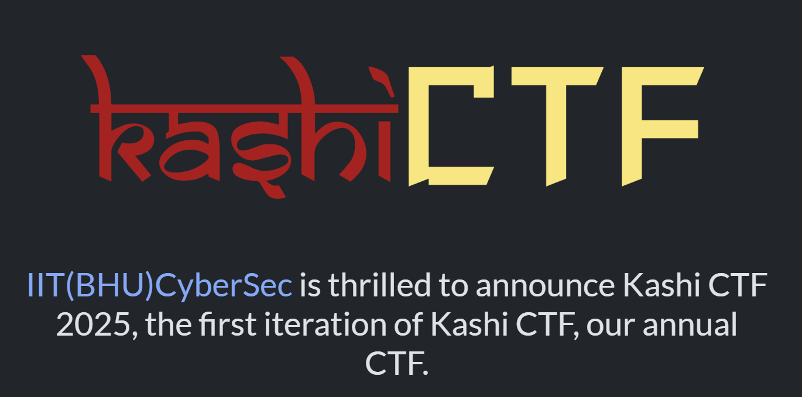

  

# KashiCTF 2025

The CTF is aimed at intermediate players (with good number of beginner and hard challenges as well). The CTF will include all general categories and will be a fun and learning experience for all participants!

URL: [https://kashictf.iitbhucybersec.in](https://kashictf.iitbhucybersec.in/)

# Table of contents

* [Crypto](Crypto)
  * [Lost Frequencies (100 pts)](Crypto/Lost-Frequencies.md)
* [Forensics](Forensics)
  * [Corruption (100 pts)](Forensics/Corruption.md)
  * [Memories Bring Back You (100 pts)](Forensics/Memories-Bring-Back-You.md)
  * [Stego Gambit (480 pts)](Forensics/Stego-Gambit.md)
* [Miscellaneous](Miscellaneous)
  * [Easy Jail (100 pts)](Miscellaneous/Easy-Jail.md)
  * [SNOWy Evening (205 pts)](Miscellaneous/SNOWy-Evening.md)
* [Reverse](Reverse)
  * [Game 1 - Untitled Game (100 pts)](Reverse/Game-1-Untitled-Game.md)
* [Web](Web)
  * [Corporate Life 1 (137 pts)](Web/Corporate-Life-1.md)
  * [Corporate Life 2 (261 pts)](Web/Corporate-Life-2.md)
  * [SuperFastAPI (100 pts)](Web/SuperFastAPI.md)
