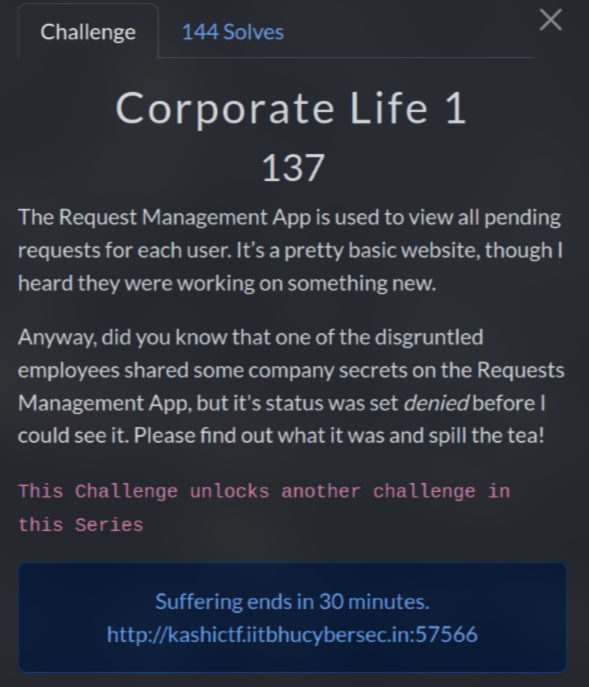
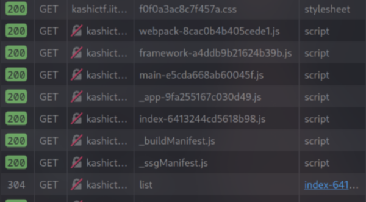
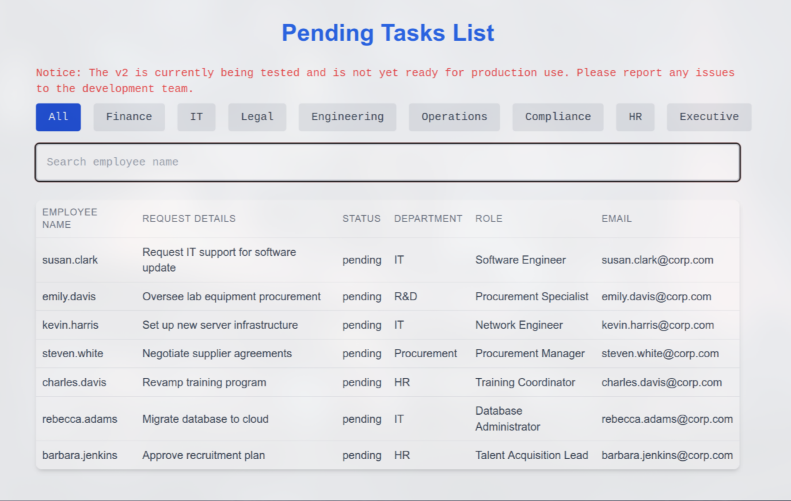
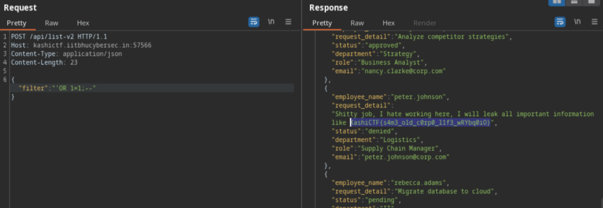

# Corporate Life 1 (137 pts)



I started by recon, and I found some `js` files, and an `/api/list` endpoint. However, I couldn't find any useful information regarding that endpoint, so I decided to skip it :v



When look at `_buildManifest.js`, I see some intesting things

```js
self.__BUILD_MANIFEST = function(e, r, s) {
    return {
        __rewrites: {
            afterFiles: [],
            beforeFiles: [],
            fallback: []
        },
        __routerFilterStatic: {
            numItems: 0,
            errorRate: 1e-4,
            numBits: 0,
            numHashes: null,
            bitArray: []
        },
        __routerFilterDynamic: {
            numItems: 0,
            errorRate: 1e-4,
            numBits: e,
            numHashes: null,
            bitArray: []
        },
        "/": ["static/chunks/pages/index-6413244cd5618b98.js"],
        "/_error": ["static/chunks/pages/_error-fde50cb7f1ab27e0.js"],
        "/v2-testing": ["static/chunks/pages/v2-testing-fb612b495bb99203.js"],
        sortedPages: ["/", "/_app", "/_error", "/v2-testing"]
    }
}(0, 0, 0), self.__BUILD_MANIFEST_CB && self.__BUILD_MANIFEST_CB();
```

As you can see, there is a testing endpoint called `/v2-testing`



There is also a search bar on the page, so I decided to test it out

I first tried `'OR 1=1;--` to testing **SQL Injection** but no luck~

Then I realized that clicking on the fields also sent a request


So I tried again and the flag showed up =)))



`Flag: KashiCTF{s4m3_old_c0rp0_l1f3_wRYbq0iO}`
