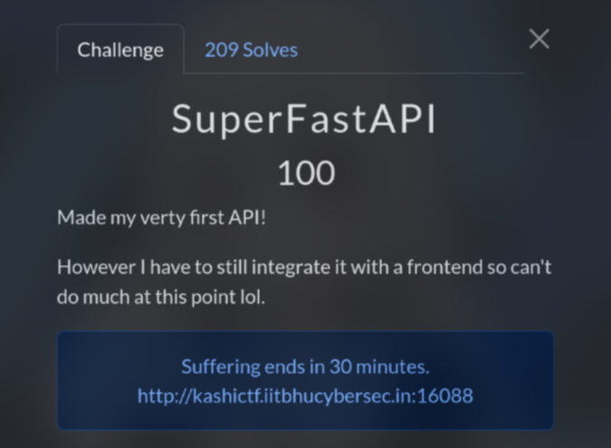
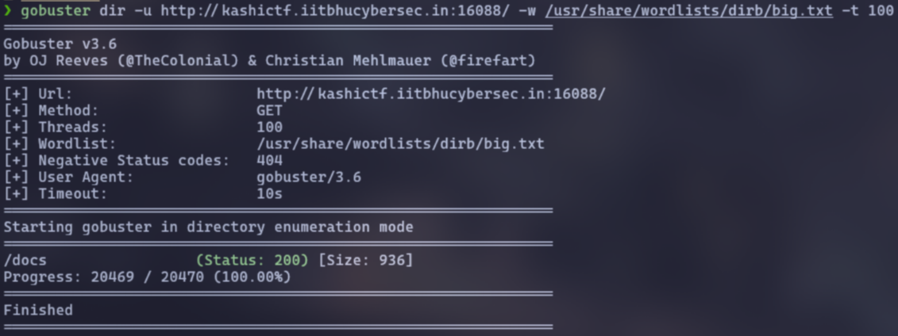
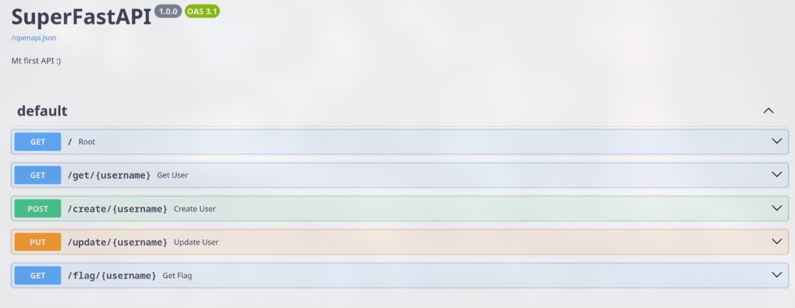
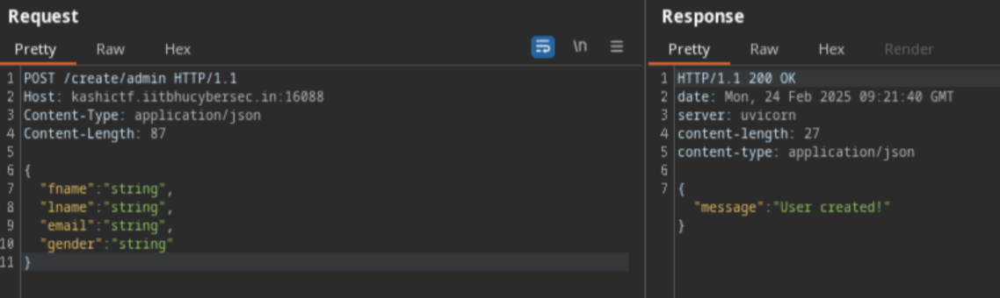
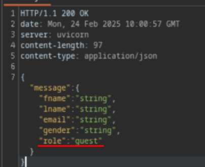

# SuperFastAPI (100 pts)



As with any web challenge, I will recon first. However, after a while, I can't find any parameters or suspicious scripts

So I decide to scan path using `gobuster` in hopes of finding something useful ヽ(ー_ー )ノ

```sh
gobuster dir -u http://kashictf.iitbhucybersec.in:16088/ -w /usr/share/wordlists/dirb/big.txt -t 100
```



And I found `/docs` path, here I could see some of the endpoints



Let's create a user first. Click **Try it out** at `/create` endpoint, then input a username, and click **Execute**. I recommend using `Burp Suite` to intercept the request for easier editing later on

Here I created **admin**



Next, I see that `/get/admin` retrieves the information for the user **admin**, and it also shows a **role**



`/update/admin` will update information for user **admin** and the `/flag/admin` will get the flag

However, the `/flag/admin` endpoint only allows for users with an **admin** role. This means I need to change the **role** from **guest** to **admin**

So why we didn't add the **role** when used `/update/admin`?

```txt
PUT /update/admin HTTP/1.1
Host: kashictf.iitbhucybersec.in:1608
Content-Type: application/json
Content-Length: 89
{
  "fname": "test",
  "lname": "test",
  "email": "test@gmail.com",
  "gender": "male",
  "role": "admin"
}
```

After updating the role, I just need to visit `/flag/admin` to get the flag

`Flag: KashiCTF{m455_4551gnm3n7_ftw_jtnRePKns}`
