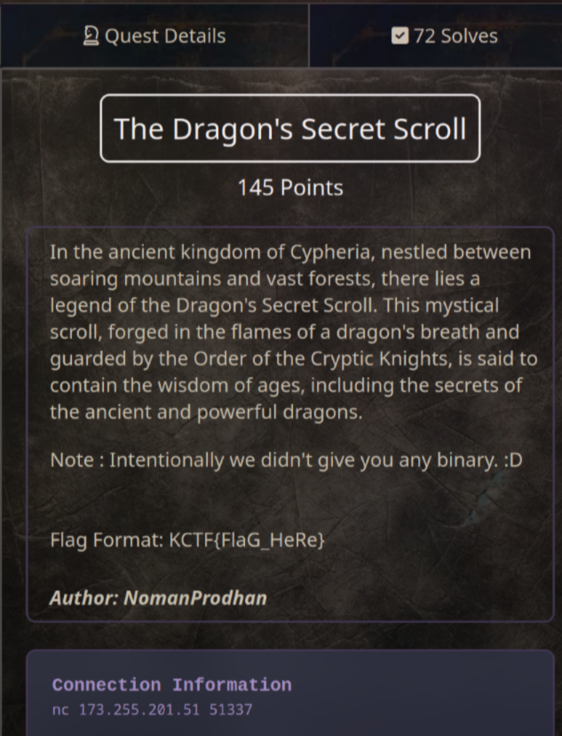
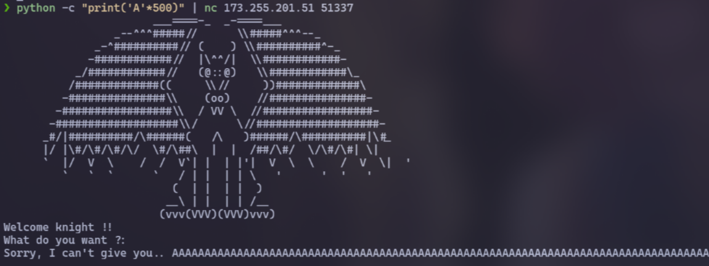
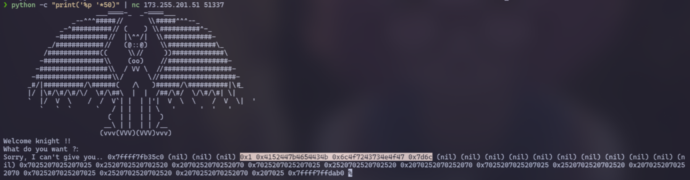
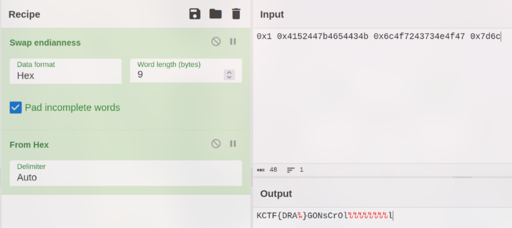

# The Dragon's Secret Scroll (145 pts)



```sh
 nc 173.255.201.51 51337
```

At first, I attempted to overflow the server with numerous 'A' characters, but it was unsuccessful. Therefore, I suspected that there might be some other vulnerabilities~~



This time, I tested with `%x`, `%p` and I realized it has [Format String vulnerability](https://owasp.org/www-community/attacks/Format_string_attack)

```sh
python -c "print('%p '*50)" | nc 173.255.201.51 51337
```



Now, focus on the highlighted line and use [CyberChef](https://gchq.github.io/CyberChef) to decode it. Apply the `Swap endianness` and `Hex` to see the flag. Just look carefully!



`Flag: KCTF{DRAGONsCrOll}`
