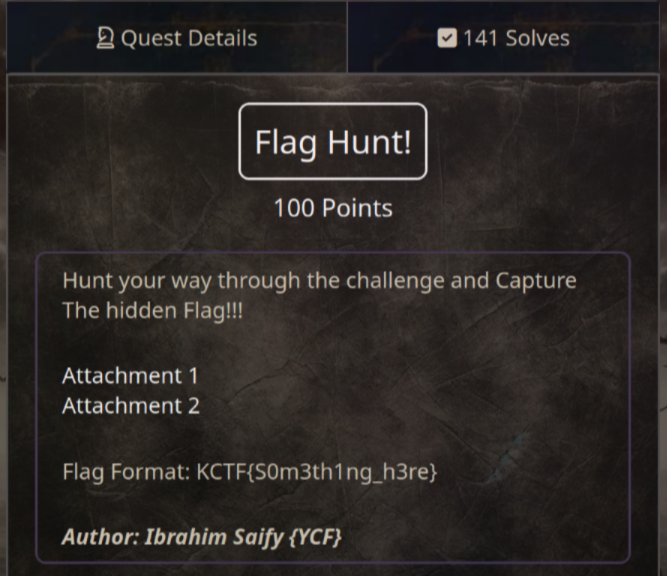
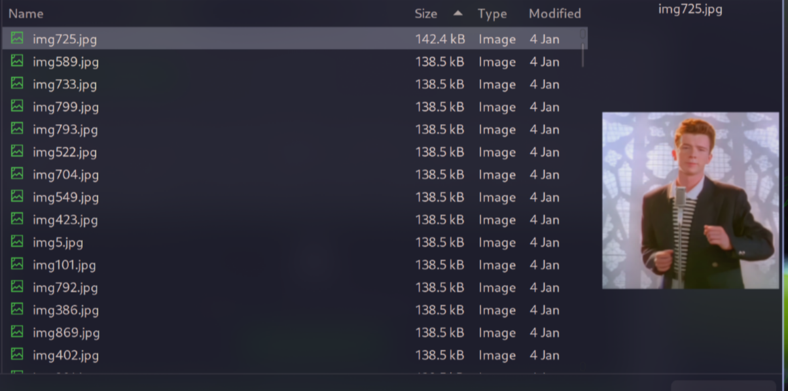

# Flag Hunt! (100 pts)



Download link: [https://drive.google.com/file/d/17nINR5uv5fwiBXAE9FGVw4UpoJQDK1UH/view](https://drive.google.com/file/d/17nINR5uv5fwiBXAE9FGVw4UpoJQDK1UH/view)

This zip file needs a password to extract but I couldn't find it, so I decided to crack it using `fcrackzip`

```sh
fcrackzip -D -p /usr/share/wordlists/rockyou.txt -u chall.zip

PASSWORD FOUND!!!!: pw == zippo123
```

Unzip the file with the password `zippo123`, and you will see a bunch of rickroll images, 2 txt files and a wav file

**n0t3.txt**:

```txt
The flag is here somewhere. Keep Searching..

Tip: Use lowercase only
```

**nooope_not_here_gotta_try_harder.txt**:

```txt
KCTF{f4k3_fl46}
```

About the `key.wav` file, I realize this is morse code and we can decode it using [this website](https://morsecode.world/international/decoder/audio-decoder-adaptive.html):

```txt
MORSECODETOTHERESCUE!!
```

After that, I literally in vain, but luckily, when tried uploading one of the rickroll images to [aperisolve.fr](https://aperisolve.fr/), I saw something suspect



**img725.jpg** have a different size than other images

This immediately let me think about [stegseek](https://github.com/RickdeJager/stegseek), a tool used to crack and find hidden content in an image

```sh
stegseek --extract img725.jpg flag.txt
```

When it required the passphrase, I tried the decoded morse code in uppercase but it was not successful. However, I recalled a helpful tip from **n0t3.txt** and changed it to lowercase to get the flag

`Flag: KCTF{3mb3d_53cr37_4nd_z1pp17_4ll_up_ba6df32ce}`
