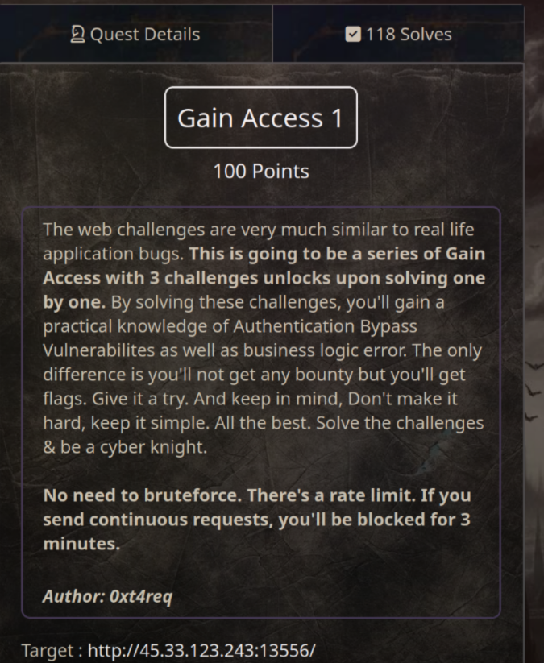
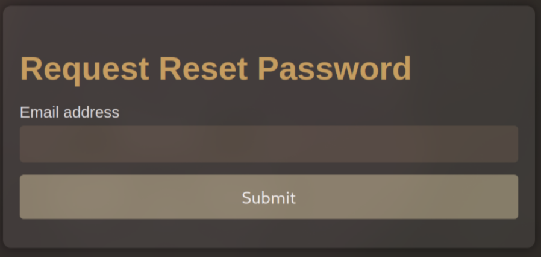
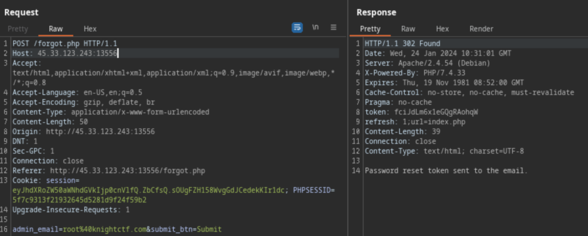
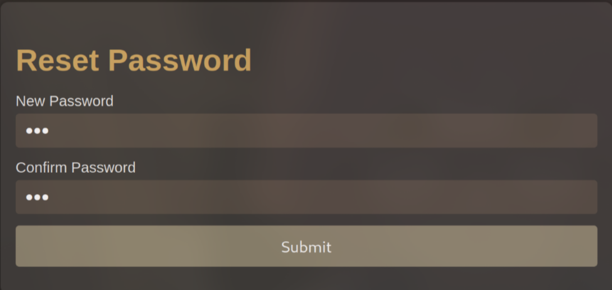

# Gain Access 1 (100 pts)



This is a login page and our mission is to find a way to bypass that to access the admin panel (= flag)

First, I analyzed the source code and found an email `root@knightctf.com` that might be useful later. The next focus was on the `Forgot Password?` function. I tried entering a different email like `27fbec16-85a8-497b-86ff-5bf0580abdd0@email.webhook.site`, but it returned `Invalid Email.`



So, I intercepted the request using Burp Suite to test it more



Here, did you see any wrong in the request response? Yes, the web returns the token! This means I can use this token to bypass authentication!

After checking **robots.txt**, I found the `/r3s3t_pa5s.php` page. I saw the `/r3s3t_pa5s.php` page required a token to work. Assuming the parameter to be `token`, I sent the above token to retrieve the reset link like this:

```
http://45.33.123.243:13556/r3s3t_pa5s.php?token=fciJdLm6x1eGQgRAohqWC
```



I successfully reset the password for `root@knightctf.com` to **123**. I then used these credentials to log in and access the admin panel, and voila! I found the flag

`Flag: KCTF{ACc0uNT_tAk3Over}`
