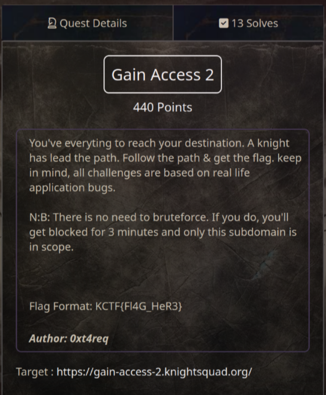
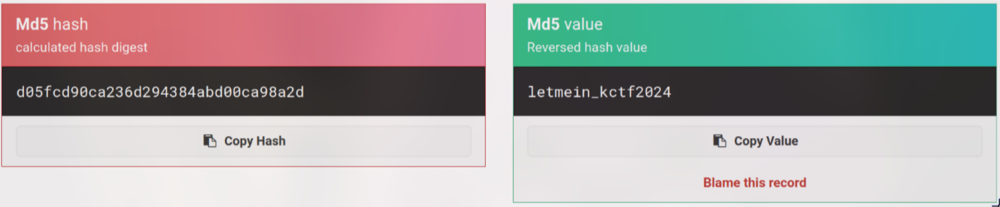
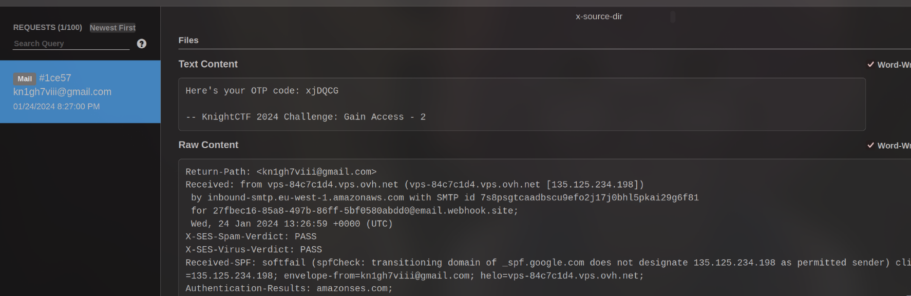

# Gain Access 2 (440 pts)



As usual, I checked the source code and found the **notesssssss.txt** file. Which contains an email and a hash (maybe?)

```txt
I've something for you. Think.....
root@knightctf.com:d05fcd90ca236d294384abd00ca98a2d
```

After searching the hash, I found [md5hashing.net](https://md5hashing.net/hash/md5/d05fcd90ca236d294384abd00ca98a2d) can unhash it



Now, I got the password is `letmein_kctf2024`. But after login in, I faced with **Two-Factor Authentication** aka 2FA

Look at the `Resend Code` function, looks like it only accepts `root@knightctf.com` as you can see in the image below


What if I add another email besides `root@knightctf.com`?

And I added `27fbec16-85a8-497b-86ff-5bf0580abdd0@email.webhook.site` to the request by using `[]`, which makes it become a list

```json
{ "email":["root@knightctf.com","27fbec16-85a8-497b-86ff-5bf0580abdd0@email.webhook.site"] }
```

I tried it and it worked. The website sent the code to my email as well




Lastly, I entered the code and got the flag for `Gain Access 2`!


`Flag: KCTF{AuTh_MIsC0nFigUraTi0N}`
