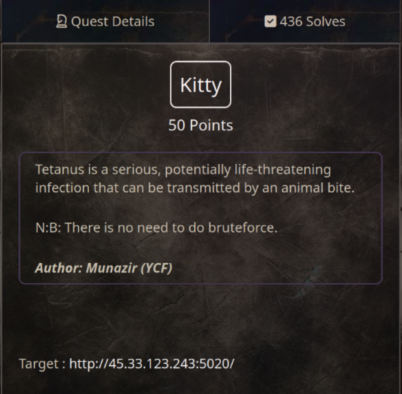
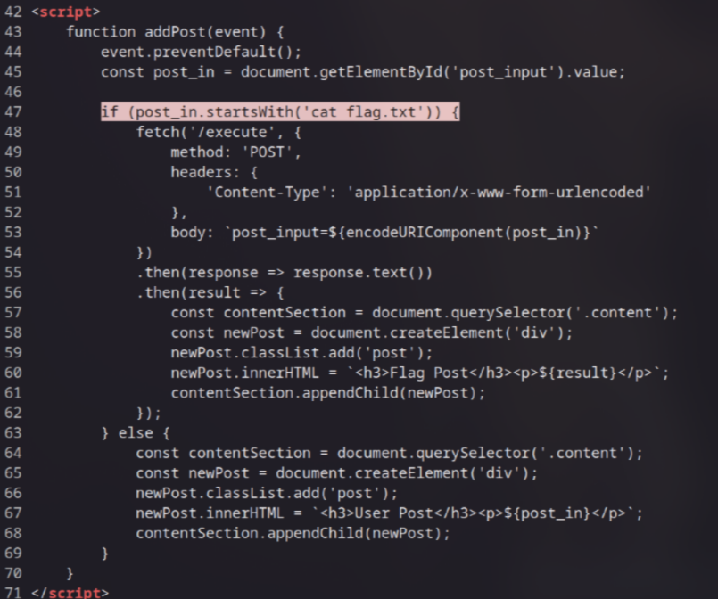

# Kitty (50 pts)

First, check the source code and I see the credentials in the **script.js** file. It's `Username:Password` as you can see in the image below

Once logged in, you will see a dashboard page with an input form for creating posts

Now, look at the source code again, I found an intersting line:

This means that all you need to do is enter `cat flag.txt` in the input form to retrieve the flag

`Flag: KCTF{Fram3S_n3vE9_L1e_4_toGEtH3R}`
