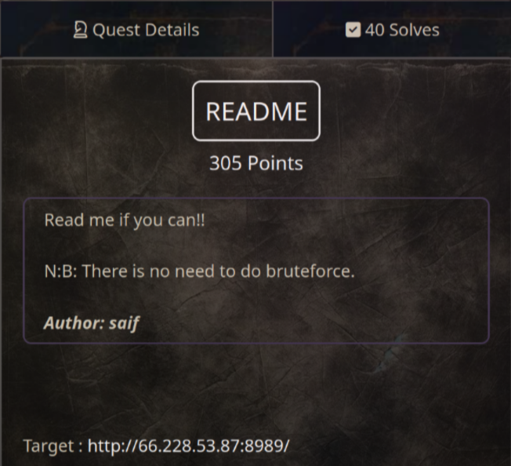

# README (305 pts)

In this challenge, we need to read the **flag.txt** file to get flag. And as I see here, I can only read **text.txt** file, **flag.txt** will return 403 status code

To bypass 403, I used `Forwarded-For: 127.0.0.1` header from [hacktricks](https://book.hacktricks.xyz/network-services-pentesting/pentesting-web/403-and-401-bypasses), and that's it!

`Flag: KCTF{kud05w3lld0n3!}`

There are a few other headers that you can try out!
