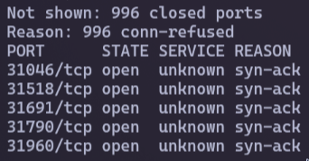

# [Bandit Level 16 → Level 17](https://overthewire.org/wargames/bandit/bandit17.html)
## Level Goal

The credentials for the next level can be retrieved by submitting the password of the current level to **a port on localhost in the range 31000 to 32000**. First find out which of these ports have a server listening on them. Then find out which of those speak SSL and which don't. There is only 1 server that will give the next credentials, the others will simply send back to you whatever you send to it.

## Solution

To complete this level, you will need to use `nmap`, a network exploration tool aka a port scanner

To scan the open ports within the range of 31000 to 32000, run the command: `nmap localhost -T4 -p31000-32000`. After running this command, you can see that there are 5 open ports:



Next, you can use the `-sV` flag to identify which of these open ports are running SSL (`-sV` is used to probe open ports to determine service/version info):

```sh
nmap localhost -sV -T4 -p31000-32000
```


Now, you will see that only 2 ports are running SSL: port 31518 and port 31790. However, port 31518 is simply an `echo`, meaning that it will just repeat the password that you input so I will focus on port 31790

To send the password to port 31790, you need to remind the [level 16](https://github.com/T3l3sc0p3/ctf-writeups/blob/master/OverTheWire/Bandit/level-16.md) when I used `openssl` to enter the password. Now, I also use that command too but with port 31790:

```sh
openssl s_client -connect localhost:31790
```

After entering the password, it will fetch the private SSH key, which is similar to what we did in [level 14](https://github.com/T3l3sc0p3/ctf-writeups/blob/master/OverTheWire/Bandit/level-14.md). To proceed, first you need to save this private key to a file (in this case is **sshkey.private**). After saving, connect to the server using the command `ssh bandit17@bandit.labs.overthewire.org -p 2220 -i sshkey.private`


Oh, look like here **sshkey.private** file permission should be changed using the `chmod 600 sshkey.private` command

Finally, connect to the server again and access the password for level 17, which is located at `/etc/bandit_pass/bandit17`

### Note

1. Now you can use password to connect to the level 17 or continue to use **sshkey.private** if you want to ;)
2. This is the explanation why I use `chmod 600`: [https://security.stackexchange.com/questions/256116/how-does-chmod-600-to-private-ssh-keys-make-them-secure-what-is-the-minimum-a](https://security.stackexchange.com/questions/256116/how-does-chmod-600-to-private-ssh-keys-make-them-secure-what-is-the-minimum-a)
