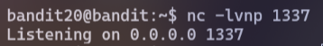

# [Bandit Level 20 → Level 21](https://overthewire.org/wargames/bandit/bandit21.html)
## Level Goal

There is a setuid binary in the homedirectory that does the following: it makes a connection to localhost on the port you specify as a commandline argument. It then reads a line of text from the connection and compares it to the password in the previous level (bandit20). If the password is correct, it will transmit the password for the next level (bandit21).

**NOTE:** Try connecting to your own network daemon to see if it works as you think

## Solution

First, you will see that there is a **suconnect** file as the task mentioned. The usage of this file is in the image below:

To solve this level, first, open another terminal and connect to this level again. Use one of the terminals to execute `nc -lvnp 1337` (1337 is a port that I usually use, but you can choose any other port)

This command will listen for any connections that are made to port 1337:

Next, in a new terminal window, run the command `./suconnect 1337` to connect to the listening port

Back to the previous terminal, and type in the current password. The server will return the password for the next level
