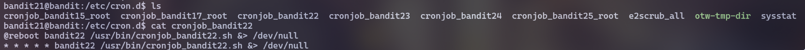
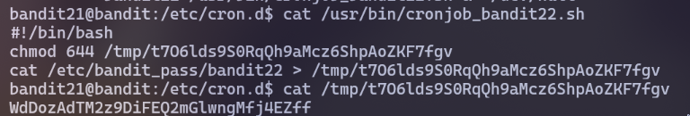

# [Bandit Level 21 → Level 22](https://overthewire.org/wargames/bandit/bandit22.html)
## Level Goal

A program is running automatically at regular intervals from **cron**, the time-based job scheduler. Look in **/etc/cron.d/** for the configuration and see what command is being executed.

## Solution

To find the password for level 22, you need to `cd` to the `/etc/cron.d/`. There are many configuration files here and one of them is **cronjob_bandit22**

Next, `cat cronjob_bandit22` and you will see that this file will run the script `/usr/bin/cronjob_bandit22.sh`

The script contains a command that prints the password for level 22 to a file. Now, you just need to read that file and you will get the password!

