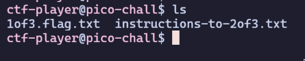
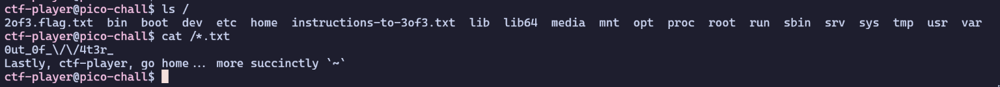
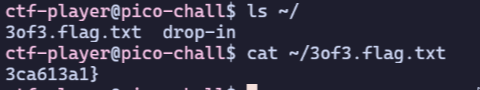

# [picoCTF 2021] [Magikarp Ground Mission](https://play.picoctf.org/practice/challenge/189)

## Description

Do you know how to move between directories and read files in the shell? Start the container, `ssh` to it, and then `ls` once connected to begin. Login via `ssh` as `ctf-player` with the password, `ee388b88`

### Hints

1. Finding a cheatsheet for bash would be really helpful!

## Solution

After launching instance, you will see a SSH command like this one: `ssh ctf-player@venus.picoctf.net -p 57140` (the port may differ)

Run that command and enter the password `ee388b88`. You'll see that there are 2 files at the server



You can run `cat *` to read 2 files as the same time. This will give you the first part of the flag, which is `picoCTF{xxsh_`, as well as instructions for the next part

Next, run `ls /` to list the files and directories at `/`. After that, read `2of3.flag.txt` and `instructions-to-3of3.txt`. You can read both of them by just using the command `cat /*.txt`



Now, you get the second part of the flag, which is `0ut_0f_\/\/4t3r_`. To get the final part of the flag, run `ls ~/` and read the `3of3.flag.txt` file to obtain the final part of the flag, which is `3ca613a1}`



```Flag: picoCTF{xxsh_0ut_0f_\/\/4t3r_3ca613a1}```

### Note

You can use `cd` command to change directory

`pwd` to print name of current/working directory

If you want to learn more about command flags, use the `man` command followed by the name of the command to get more information!
