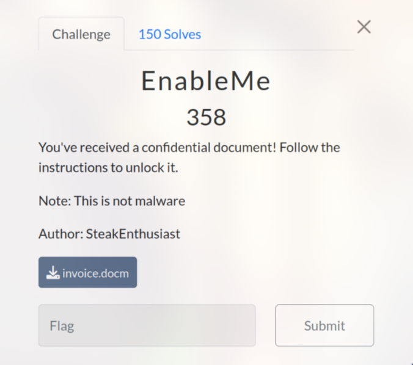
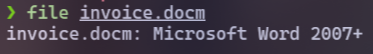
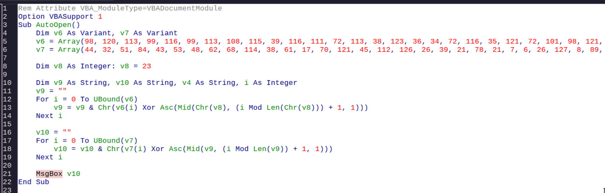

# EnableMe (358 pts)

First, I ran the command `file invoice.docm` to determine the file type and I knew that this was a word file

When opened it, I saw that there was a macro script in the file. And I just need to change `MsgBox` from `v10` to `v9` in the `AutoOpen` macro script to obtain the flag

`Flag: uoftctf{d0cx_f1l35_c4n_run_c0de_t000}`

In case you were curious, the value of `v10` is: `YOU HAVE BEEN HACKED! Just kidding :)`
