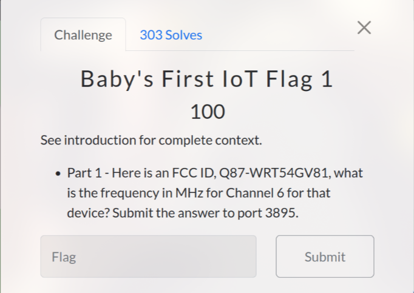

# Baby's First IoT Flag 1 (100 pts)

First, I search "FCC ID, Q87-WRT54GV81" on Google and found some results like: [https://fccid.io/Q87-WRT54GV81](https://fccid.io/Q87-WRT54GV81)

After then, I click on "Frequency Range" and go to this link: [https://fccid.io/frequency-explorer.php?lower=2412.00000000&upper=2462.00000000](https://fccid.io/frequency-explorer.php?lower=2412.00000000&upper=2462.00000000)

Lastly, I take the value from "Frequency Center" is `2437` MHz and send it to port 3895 to get the flag

`Flag: {FCC_ID_Recon}`
