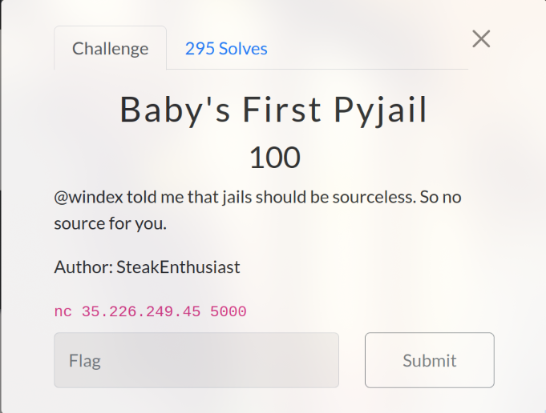
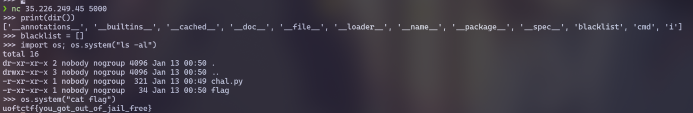

# Baby's First Pyjail (100 pts)



```python
# List the attributes and the blacklist
print(dir())
# Make the blacklist empty
blacklist = []
# import os to execute command and get flag~
import os; os.system("ls -al")
os.system("cat flag")
```



`Flag: uoftctf{you_got_out_of_jail_free}`
