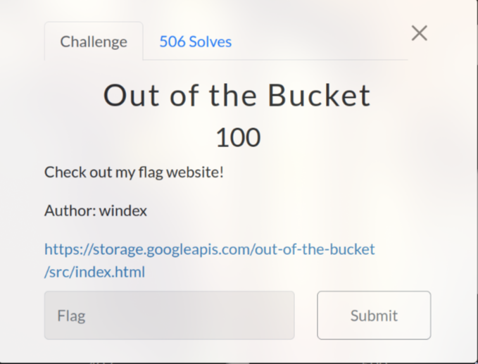
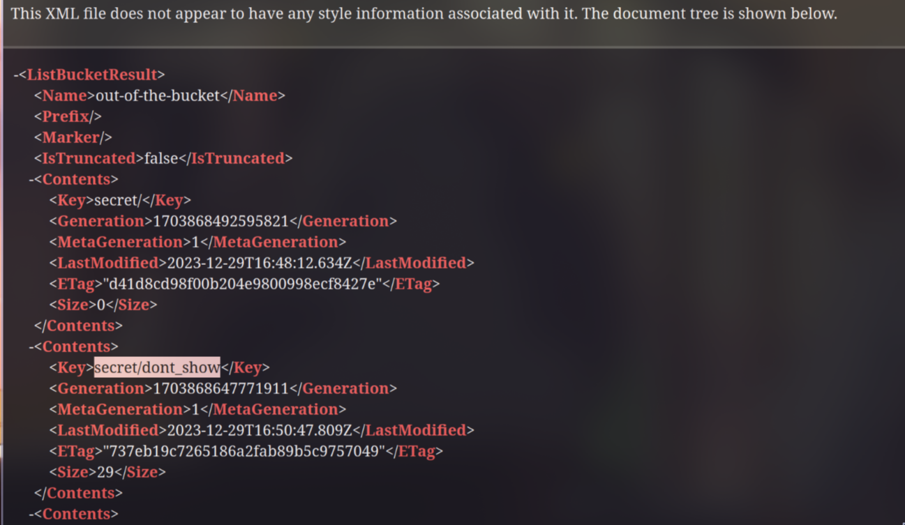

# Out of the Bucket (100 pts)

After examining the url for a while, I saw an XML file when accessing [https://storage.googleapis.com/out-of-the-bucket/](https://storage.googleapis.com/out-of-the-bucket/)

As you can see in the image below, there is a file named **dont_show** in **secret** directory

Download and read the file to obtain the flag:

`Flag: uoftctf{allUsers_is_not_safe}`
