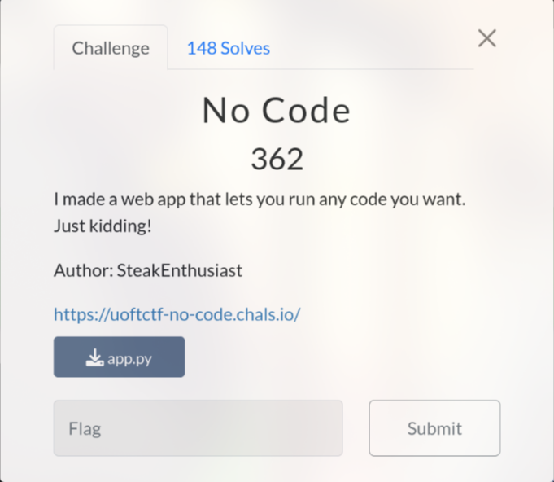
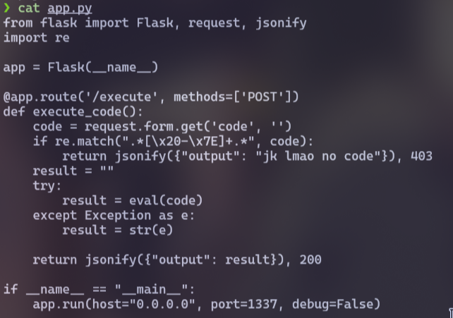
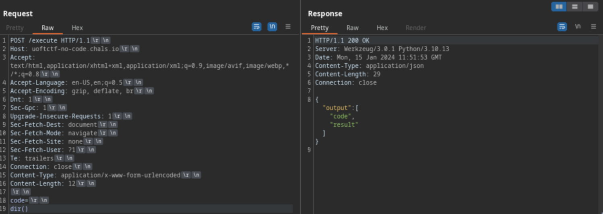
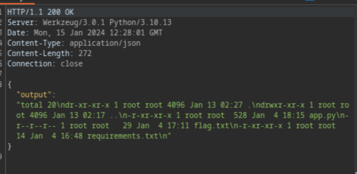

# No Code (362 pts)



Firstly, I analyzed the source code, which revealed that the function would read code from the parameter `code` with the `POST` method at the `/execute`



However, there was a regex (Regular Expression) to filter all printable characters at the beginning, which made it impossible to add any code

After using [regexr.com](https://regexr.com/), I realized that this regex only filtered almost everything except the line break `\n`

I hypothesized that this regex only filtered the code before the line break, not after it, as it appeared in some Command Injection CTF challenges that I solved before. And this hypothesis was correct. After adding a line break, I was able to run Python code, but with some limitations



To speed up the process, I used a [SSTI payload](https://github.com/swisskyrepo/PayloadsAllTheThings/blob/master/Server%20Side%20Template%20Injection/README.md#exploit-the-ssti-by-calling-ospopenread) to run the command without restrictions

```python
__builtins__.__import__('os').popen('ls -al').read()
```



Finally, I executed the `cat flag.txt` command to obtain the flag

```python
__builtins__.__import__('os').popen('cat flag.txt').read()
```

### Notes: I actually solved `No Code` challenge before the source code was published =))

`Flag: uoftctf{r3g3x_3p1c_f41L_XDDD}`
