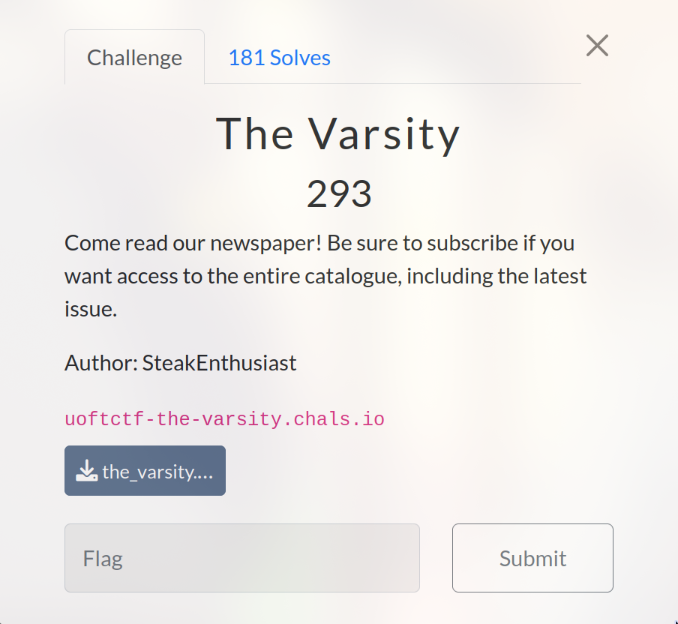
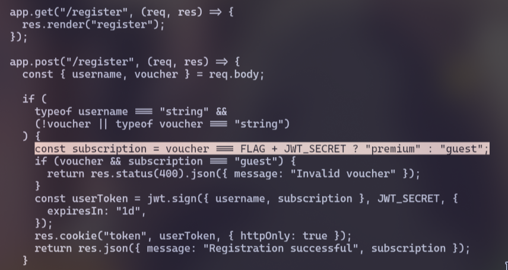
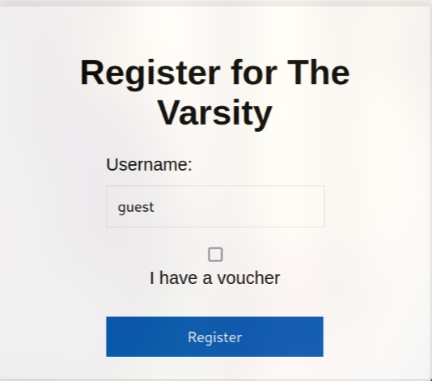
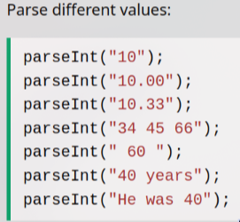
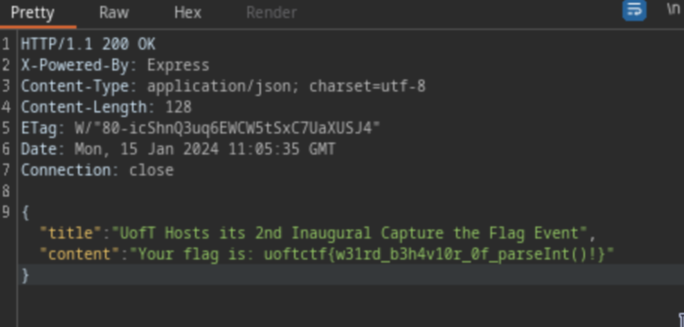

# The Varsity (293 pts)

This is a newspaper website. At first, look at the **server.js* file in the source code. We see that if we want to access the entire catalogue, we must be "premium"

However, this seems impossible because we need **FLAG** value, so we will register without voucher

Also in that **server.js** file. We see that the last article contains the flag but it need to be "premium" to read the article

Most people attempt to bypass this by changing the JSON Web Token (JWT) token. However, this method does not work and results in a "Not Authenticated" error

Upon closer inspection, I discover that the `parseInt()` function has a weird behavior as you can see in the image below:

By modifying the value `{"issue":"9"}` to `{"issue":"9 8"}` or any other similar value, we can access the article that contains the flag

`Flag: uoftctf{w31rd_b3h4v10r_0f_parseInt()!}`
