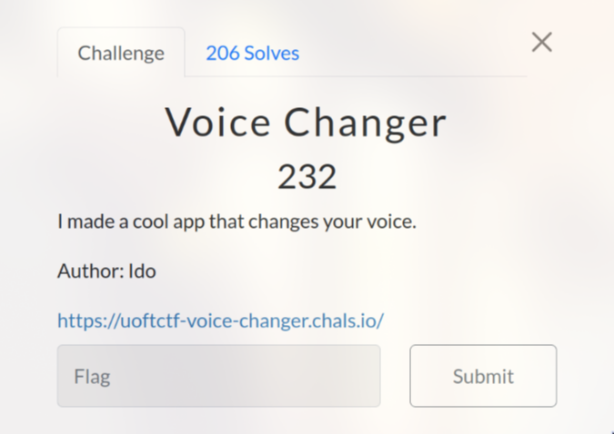
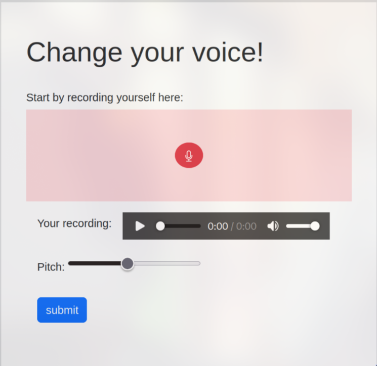
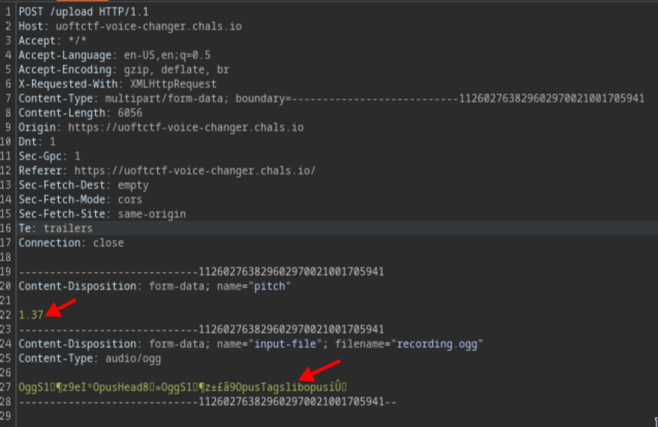
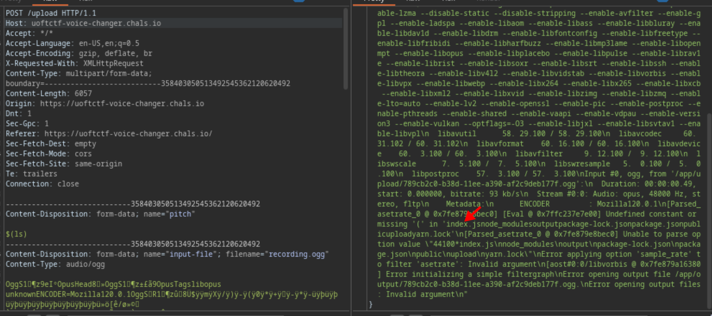

# Voice Changer (232 pts)



This is a web application that allows us to alter our voice by changing the pitch



If you try to record and use Burp Suite to intercept the request, you will notice that there are two places where malicious code can be injected: the "pitch" and "input-file" fields



At first, I attempted to upload a PHP shell script, but unfortunately I was unable to upload any shell to the server. Therefore, I changed to injecting the "pitch"

```sh
$(ls)
```

When looked at the output, I noticed that some files appeared, which meant that I could execute code on the server. This type of vulnerability is called **OS Command Injection**~



After some searching, I found a **secret.txt** file in **/**. Now, all I needed to do was run this command to obtain the flag:

```sh
$(cat /secret.txt)
```

`Flag: uoftctf{Y0URPitchIS70OH!9H}`
