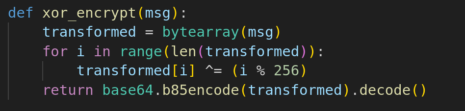

# Chaos


Analyze `challenge.py`, I noticed that the flag was shuffled randomly within the messages. Each message was encrypted using **XOR** and **Base85**



After analyzing the problem, I decided to write a script to decode the messages and find the flag:

1. Reverse **Base85** to obtain the **XOR-encrypted** bytes
2. Reverse the **XOR** operation using `(i % 256)`, which revealed the messages mixed with the flag

```python
#!/usr/bin/python3
import base64

def xor_decrypt(encoded_msg):
    # Decode from Base85 and reverse the XOR (each byte XOR'ed with its index modulo 256)
    decoded = base64.b85decode(encoded_msg)
    transformed = bytearray(decoded)
    for i in range(len(transformed)):
        transformed[i] ^= (i % 256)
    return transformed.decode(errors='ignore')

# Read the encrypted messages from the file, separated by double newlines
with open('output.txt', 'r') as f:
    encrypted_messages = f.read().strip().split('\n\n')

# Decrypt each message and print them
for i, msg in enumerate(encrypted_messages, 1):
    print(f"Message {i}: {xor_decrypt(msg)}")
```

After running the script, I got some flags


Some flags:

```txt
VishwaCTF{Fl4g_Or_N0t_Th4t_1s_Th3_QuesT10n}​
VishwaCTF{T00_M4ny_F4k3_Fl4Gs_G00d_Luck}
VishwaCTF{CrYpt0_cRyPT0_1g_It_1s_sOm3_7hiNg_t0_D0}
VishwaCTF{NoT_ThE_ReaL_fLaG_K33P_tRy1Ng}
VishwaCTF{Y0u_WiLl_N3v3r_F1nd_1t}
```

After some attempts, I found the flag, it the longest one

`Flag: VishwaCTF{CrYpt0_cRyPT0_1g_It_1s_sOm3_7hiNg_t0_D0}`
