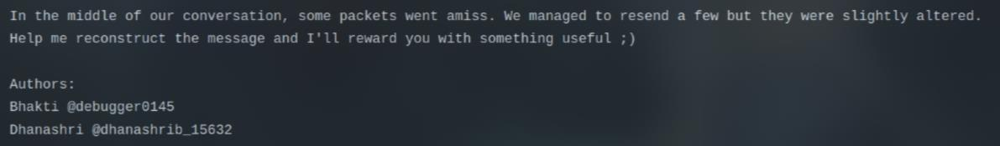
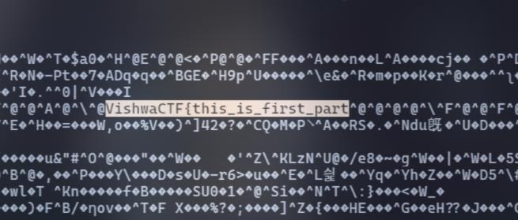
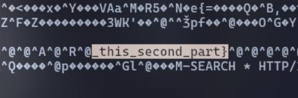

# Leaky Stream

I'm a web player, not a forensics player, so when I saw these type of challenge, first I will `nano chitty-chat.pcapng` on terminal then search for `VishwaCTF{`

I found: `VishwaCTF{this_is_first_part`

Then, I thought there might be a second part of this somewhere, so I search for "second" and I got the flag, sound dumb but this is actually how I solve this chall (o_O)

`Flag: VishwaCTF{this_is_first_part_this_second_part}`
