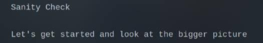

# Sanity Check

There is a `sanity.txt` and if you look carefully, you will see something like **Vish...**. I just need to use `gedit` to zoom it out and I got the flag

`Flag: VishwaCTF{being_a_jack_of_all_is_better_then_being_a_master_at_one}`
