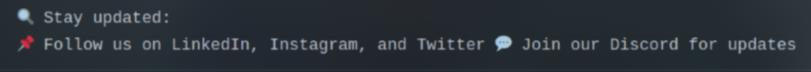
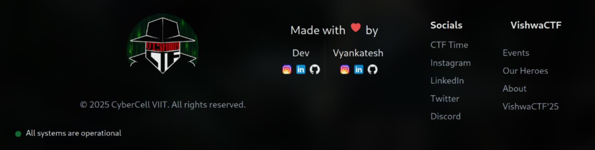
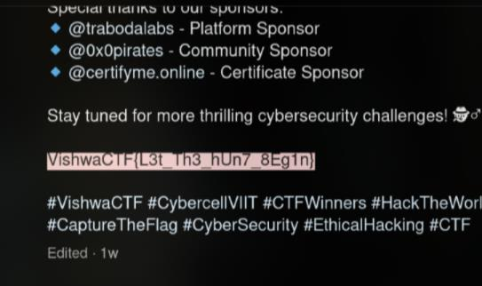

# Follow for Clues

So at first, I will find **LinkedIn**, **Instagram** and **Twitter** of **VishwaCTF**, of course ._.

I can find all of it through the main page vishwactf.com except **Twitter (X)**
- **LinkedIn**: https://www.linkedin.com/company/cybercell-viit/
- **Instagram**: https://www.instagram.com/cybercell_viit/

About **X (Twitter)**, I just need to search on Google "VishwaCTF Twitter" and I got the link
- **Twitter (X)**: https://x.com/cybercellviit

However, I haven't found any flags in posts on **LinkedIn** or **Twitter (X)**. The only remaining social media platform to check is **Instagram**

My strategy for finding the flags is straightforward: I look at the newest posts and then way back to the oldest ones, starting from when the contest began

Then I found this post: https://www.instagram.com/p/DGXe34GvDjq/

`Flag: VishwaCTF{L3t_Th3_hUn7_8Eg1n}`
