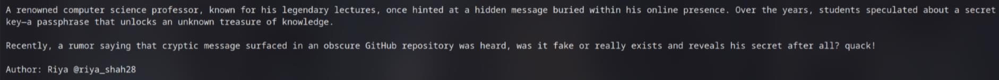
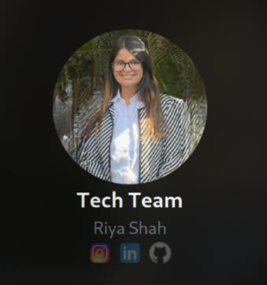
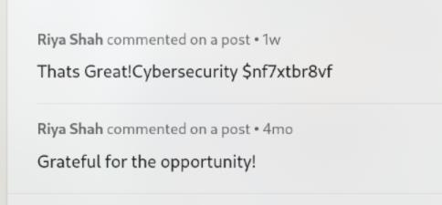
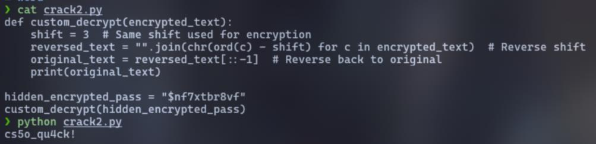

# The Lecture Code

Look carefully on the description, I noticed something different than other challs

First, the author only found on this chall. Second, he/she also include `@riya_shah28`, which want to tell us "Hey, this is my username, you have to find me"

So I will find as your request :)

At https://vishwactf.com/heroes, I found **Riya**

Look at her **LinkedIn** and look to the comment section, I saw the "cryptic message":

Then, I look at her **GitHub**, I found a **cs50cybersecurity** repo: https://github.com/ri285/cs50cybersecurity

Here, I found 3 **Python** files but only `crack2.py` actually works

So I clone it to my machine, replace the `hidden_encrypted_pass` and then `python crack2.py` :3

`Flag: VishwaCTF{cs5o_qu4ck!}`
