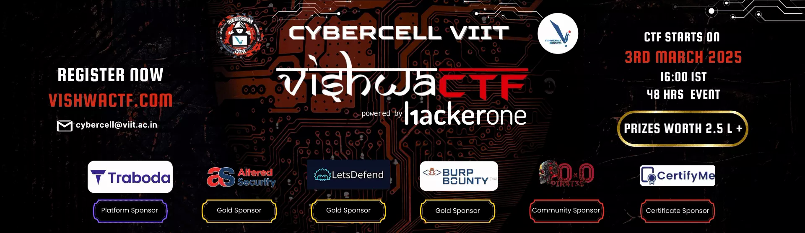

  

# VishwaCTF 2025

VishwaCTF is the Flagship event of CyberCell-VIIT. It will be an Jeopardy style CTF with team participation. The CTF will be live for 48 hours, and top winners will be awarded with prizes. A beginer friendly CTF open for all

URL: https://vishwafinal.eng.run/

# Table of contents

* [Miscellaneous](Miscellaneous)
  * [Sanity-Check](Miscellaneous/Sanity-Check.md)
* [Web](Web)
  * [Are-We-Up](Web/Are-We-Up.md)
  * [Flames](Web/Flames.md)
  * [forgot-h1-login](Web/forgot-h1-login.md)
  * [scan-it-to-stay-safe](Web/scan-it-to-stay-safe.md)
* [Forensics](Forensics)
  * [Leaky-Stream](Forensics/Leaky-Stream.md)
* [Crypto](Crypto)
  * [Chaos](Crypto/Chaos.md)
    * [chaos-script.py](Crypto/script/chaos-script.py)
* [OSINT](OSINT)
  * [Follow-for-Clues](OSINT/Follow-for-Clues.md)
  * [Stadium](OSINT/Stadium.md)
  * [The-Lecture-Code](OSINT/The-Lecture-Code.md)
* [Steganography](Steganography)
  * [Spilled-Paint-Water](Steganography/Spilled-Paint-Water.md)
