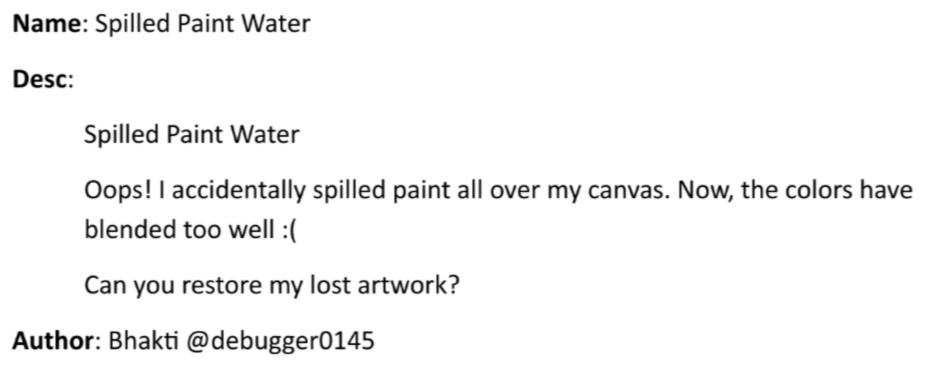

# Spilled Paint Water



If you look at this SVG, you will notice that it's covered by a large blue rectangle. So you just need to delete these lines to remove it

```html
<clipPath id="clipArea">
    <rect x="1000" y="1000" width="200" height="200"/>
</clipPath>
```

Then use **svgviewer.dev** to view it and you will got the flag

`Flag: VishwaCTF{STROKE__N_FILL}`
