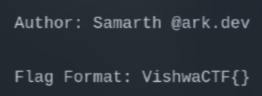
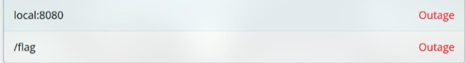
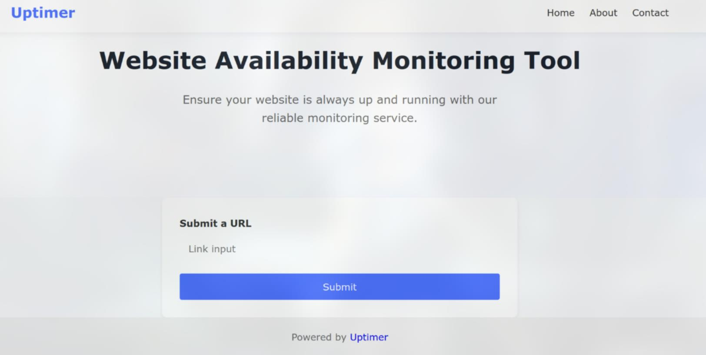
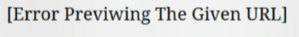

# Are We Up?

At first, I had no idea how to proceed since there was no instance to examine and no clues to follow, so I skipped this chall

But later, a hint release. It told me that I must look at the status of **vishwactf.com**

Hmm, what does "status" mean? I don't know so I just randomly try some path like `/health-check`, `/health`,... until I saw a green dot at the end, it right on the main page

This actually lead me to a website **web.eng.run:8501** or **are-we-up-3dd2awd2.ctf-delivery-net.pp.ua** (after the contest end)

On this page, I found a `/flag` endpoint and a `local:8080`, but it turned out to be a fake flag :(

~~VishwaCTF{L0L_7H15_15_N07_7H3_Fl49}~~

Look at the source code, I found `/uptimer-a343s19` endpoint

Alright, look like we have another SSRF challenge ~

My first try is http://127.0.0.1:8080/flag but no luck, it forbidden

After some testing, I realized some filters like only allow http, https or block `127.0.0.1`,...

At first, I focused on the ip address and try to turn it to `0.0.0.0`, `2130706433`,... but none of those worked

I started brainstorming and realized I had overlooked something: what about redirects? I attempted to set up a host that could redirect, but since I'm broke, you know...

So I tried using ngrok, but somehow it didn't work

Then I tried another easier method, other people host :)

As you can see in the [PayloadAllTheThings](https://github.com/swisskyrepo/PayloadsAllTheThings/tree/master/Server%20Side%20Request%20Forgery#bypassing-using-a-redirect), there is an url https://307.r3dir.me/--to/?url=http://localhost, which can redirect

When I tried that, another different error occur

Then, I changed to https://307.r3dir.me/--to/?url=http://localhost:8080/flag

However, this time it return the fake flag. This made me wonder if the internal server also had filters in place. So I changed to https://307.r3dir.me/--to/?url=http://127.0.0.1:8080/flag and I got the real flag

`Flag: VishwaCTF{Y0r4_lo7al_b4bby_A4k18aw2}`
