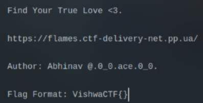
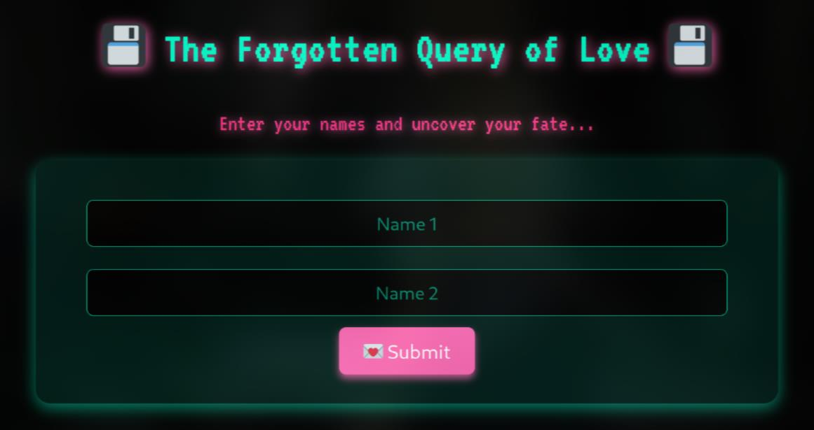
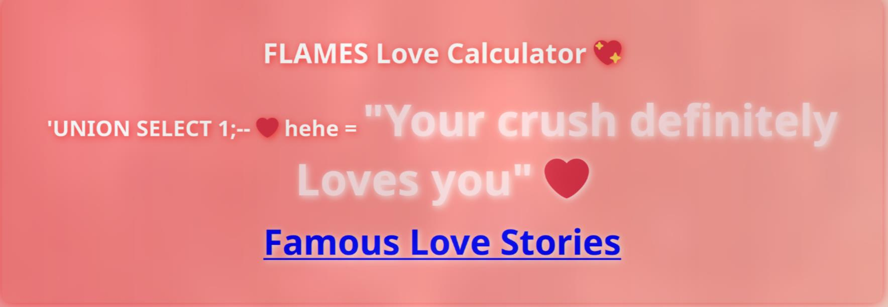

# Flames

Link: https://flames.ctf-delivery-net.pp.ua

First, I look at the challenge and its source. I noticed that it required a username and password and it also has a term **Query of Love**, which immediately reminded me of the SQL Injection

I tried to `'OR 1=1;--` for both the username and password fields, but it didn't work

Then, I tried to break the algorithm of the flame calculator and still got nothing (-_-)

The only idea is from the query, maybe it was SQL Injection but with different payload. I tried `'UNION SELECT 1;--` and a new page show up

Finally, I just need to follow https://flames.ctf-delivery-net.pp.ua/lovers_db.php in **Famous Love Stories** to get the flag :3

`Flag: VishwaCTF{SQL_1nj3ct10n_C4n_Qu3ry_Your_He4rt}`

P/s: I realized the challenge is actually very easy, any payload with `UNION SELECT` will work lmao
