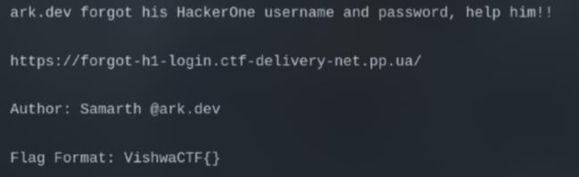
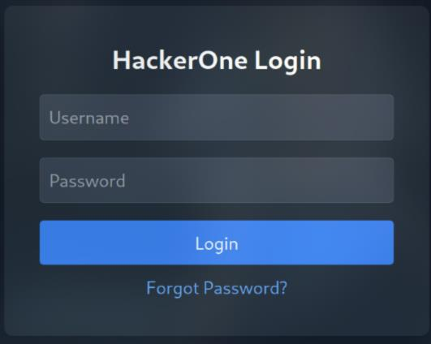
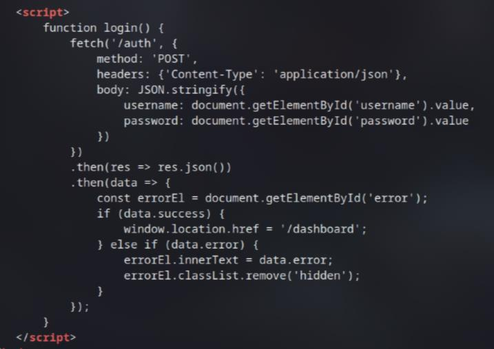
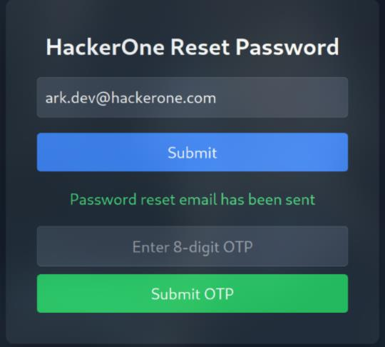
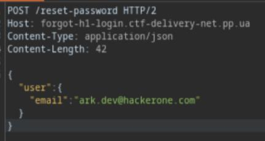
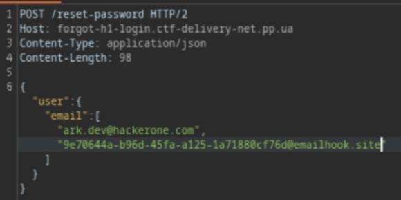
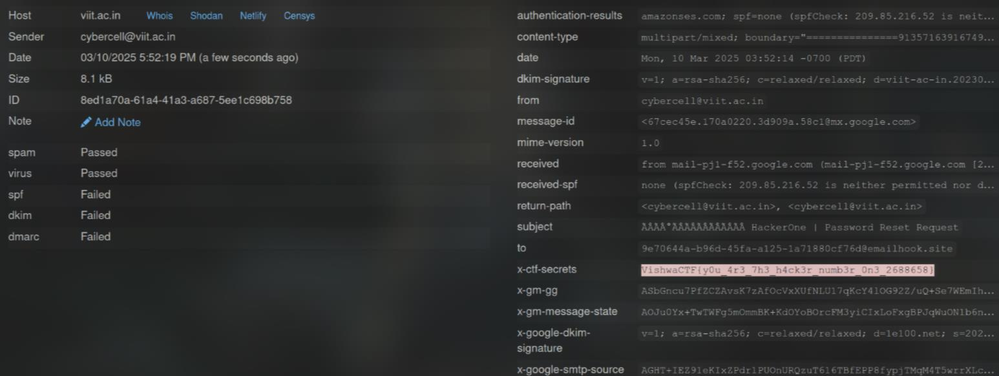

# forgot-h1-login

Link: https://forgot-h1-login.ctf-delivery-net.pp.ua

Like every other web chall, I recon the web, and I realized that I must focus on the login page because it was the only available feature here :)

Look at the source of `/login`, I saw `/dashboard` and `/auth` path

In `/dashboard`, I look at the source code again and I found an email in the comment: `ark.dev@hackerone.com`

Back to the login page, there is another feature, **Reset Password**. It require to enter the email, and of course, I will try the `ark.dev@hackerone.com` first no matter what

Here, it returns an OTP form. However, brute force a long OTP code seem impossible, so I must find some other way to get the code

I use **Burp Suite** to intercept the reset password request first to investigate more

Hmm, wait a minute, I noticed some thing similar, it was actually same as my previous writeup here: https://t3l3sc0p3.github.io/posts/knightctf-2024-writeup/#gain-access-2-440-pts

The idea is actually easy, you just need to add your email next to the valid one, then add `[]` to turn it to an array. This way, the code will be return to both of them

With experience from **scan-it-to-stay-safe** challenge, I use webhook email instead of my ctf email just to make sure I'm not missing any thing hehe

And with this caution, I got the flag very fast. If I remember correctly, I was the **6-7th** solver

`Flag: VishwaCTF{y0u_4r3_7h3_h4ck3r_numb3r_0n3_2688658}`
