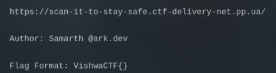
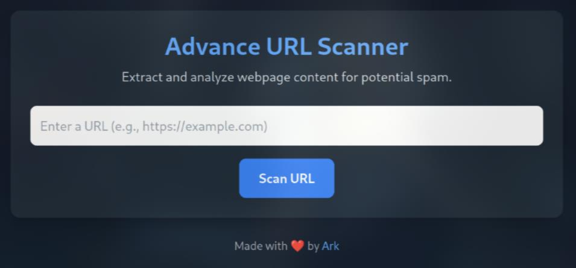
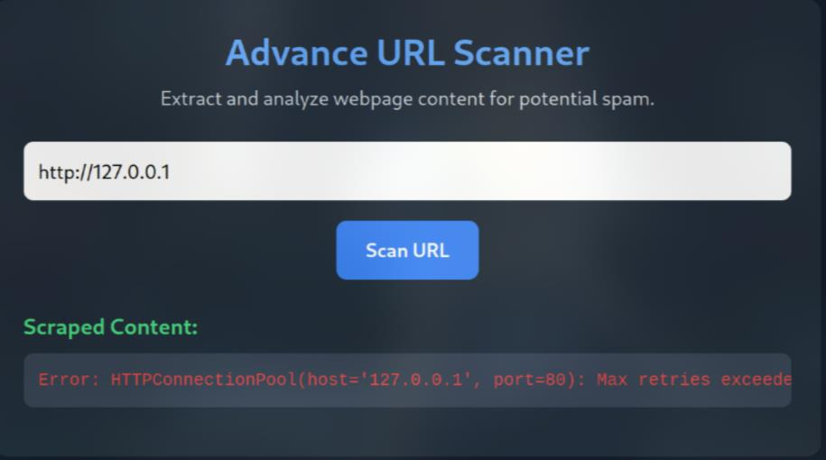
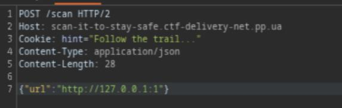
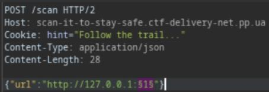
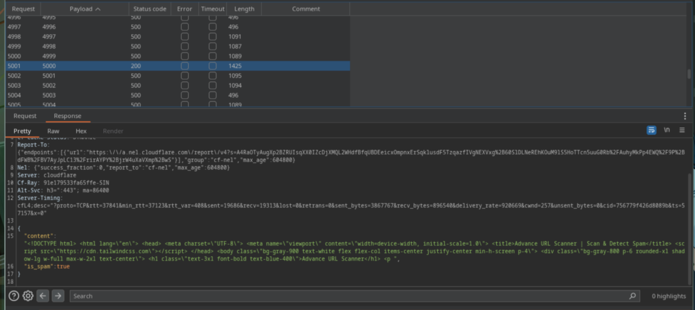
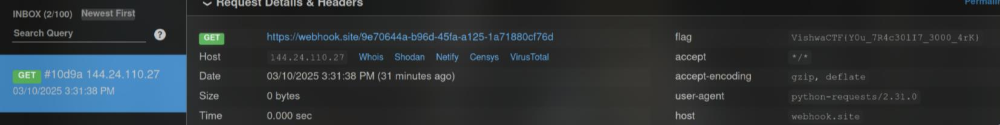

# scan-it-to-stay-safe

Link: https://scan-it-to-stay-safe.ctf-delivery-net.pp.ua

This is a web chall that will scan for any website to check if it has spam content. But is it filter internal addresses like `127.0.0.1`?

It seems that it didn't block the internal address, however an error exists. As I'm familiar with this vuln, This error can be the port 80 is not the port used to host, that why it can't connect

So I started with the scan port process. The main point of this scan is to find out which port the server use to host the web. Or if we're lucky enough, we can found some ports from Redis, FastCGI, Zabbix,...(@_@)

You can write a Python script to scan or if you have Burp Suite Pro, follow these:

Enter http://127.0.0.1:1 or any other port and use Burp Suite to intercept the request. Here you can see a hint "Follow the trail..." in the cookie. However, I didn't know what it means so just skip it =))

Next, press **Ctrl + I** to send it to **Intruder**

Then, add the position, where the port will be inserted

After that, in the Payloads tab, choose **Payloads type** is **Numbers** with range from `0` to `65536`

Finally, click **Start attack** and wait to see if there is any difference in response length

After scanning, I found `port 5000`, yay

The next idea is to found some hidden paths in `port 5000`, and here I use dirb wordlist

Later, I found `/console`. However, after some tests with the internal **Werkzeug**, I wasn't able to execute commands or exploit path traversal to get the flag :(

Back to the hint, I thought I must have missed something. So, I tested again, this time using **webhook.site** to receive the response. I guessed that **follow the trail** likely meant to follow the response

And yea, my guess was right, the flag was on the response header, I just overlooked everything :(

`Flag: VishwaCTF{Y0u_7R4c30lI7_3000_4rK}`
